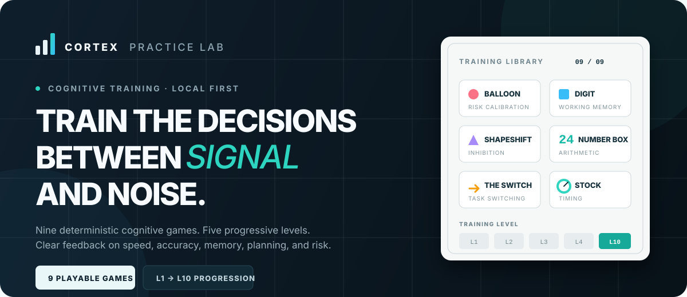

<div align="center">
  

  <br />

  [](https://react.dev/)
  [](https://www.typescriptlang.org/)
  [](https://nodejs.org/)
  [](#quality)

  **A desktop-first cognitive training lab built from public task descriptions.**

  [Get started](#run-locally) · [Explore the games](#nine-games-ten-levels) · [Architecture](docs/architecture.md) · [Scoring](docs/scoring.md)
</div>

---

## Why Cortex?

Cortex turns nine publicly described cognitive tasks from the [Quant Career Hub Zap-N guide](https://quantcareerhub.com/blog/optiver-zap-n-test-guide) into focused, replayable browser games. Each game trains a different decision skill and reports the raw measures that matter: accuracy, reaction time, planning efficiency, memory span, information gain, timing precision, and risk calibration.

| Reproducible | Progressive | Measurable | Local-first |
|---|---|---|---|
| Seeded sessions replay the same challenge | Ten levels increase the actual cognitive load | Per-round feedback and game-specific analytics | No account required; history stays in your browser |

> [!IMPORTANT]
> Cortex is independent practice software, not proprietary assessment software. `Practice Score` is a training heuristic—not an Optiver score, percentile, pass mark, or hiring prediction.

## Nine games, ten levels

Every game progresses from **L1 Foundation** to **L10 Extreme**. Five closely calibrated L4–L8 steps bridge Advanced and Expert; higher levels change the core task rather than merely repeating more rounds.

| Game | Primary skill | Level 10 challenge |
|---|---|---|
| **Balloon** | Risk calibration | 20 balloons with overlapping hidden risk profiles |
| **Skyscraper** | Planning | 7 blocks, 4 stacks, and deeper optimal paths |
| **Shapeshift** | Response inhibition | 20 fast trials with 75% incongruent stimuli |
| **Code Compare** | Visual discrimination | 14 digits, 6 choices, 900 ms response window |
| **Digit** | Working memory | 8-digit start, progression to 10, faster presentation |
| **Number Box** | Arithmetic search | Rare 24-solutions requiring division and subtraction |
| **Figure It Out** | Deductive reasoning | 80 possible figures with only 4 guesses |
| **The Switch** | Cognitive flexibility | 7-item prompts, 85% switches, 1150 ms window |
| **Stock Master** | Divided attention | 9 fast gauges with narrow, overlapping target events |

## Training experience

- Guided tutorial for every game
- Practice, full-circuit simulation, and custom sessions
- Timed and untimed modes where appropriate
- Mouse and keyboard controls with guarded double-submission
- Pause/resume that freezes both input and game timing
- Seeded replay for deterministic challenge reproduction
- Per-level best scores and comparable attempt history
- JSON and CSV performance export
- Responsive desktop layouts tested at 1440×900 and 1024×768

## Run locally

### Node.js

Requires **Node.js 22.13+** and npm.

```bash
git clone https://github.com/hrishi-bhardwaj55/ZapN.git
cd ZapN
npm install
npm run dev
```

Open **http://localhost:3000**. The browser app is fully usable without the optional API.

### Docker

```bash
git clone https://github.com/hrishi-bhardwaj55/ZapN.git
cd ZapN
docker compose up --build
```

| Service | Address |
|---|---|
| Web app | http://localhost:3000 |
| API documentation | http://localhost:8000/docs |
| PostgreSQL | `localhost:5432` |

Stop the stack with `docker compose down`.

## Useful routes

| Route | Purpose |
|---|---|
| `/` | Game library and individual practice |
| `/simulation` | Full nine-game session |
| `/admin/game-config` | Local developer configuration editor |
| `/?debug=true` | Seeded diagnostics during local development |

Debug hints are never displayed in production simulation mode.

## Optional API

The web app stores attempt history locally and does not require the API. To run the FastAPI service separately on Windows PowerShell:

```powershell
cd backend
python -m venv .venv
.venv\Scripts\Activate.ps1
pip install -r requirements.txt
uvicorn app.main:app --reload
```

Copy `.env.example` to `.env` when using the API or Docker services that require environment configuration.

## Quality

```bash
npm run test:unit   # 48 deterministic engine tests
npm run test:e2e    # 29 full browser tests
npm run lint
npx tsc --noEmit
npm test            # production build + rendered-page checks
```

The browser suite covers tutorials, L1/L10 progression, all ten level selectors, mouse and keyboard input, pause guards, timeouts, result persistence, console errors, and desktop layout at 1440×900 and 1024×768. Timing-sensitive games run serially so browser scheduling cannot mask game behavior.

## Project map

```text
app/                 Application shell, routes, dashboard, and responsive UI
games/<game>/        Independent React UI and deterministic engine per game
lib/                 Catalog, levels, seeded RNG, scoring, telemetry, storage
tests/unit/          Engine and edge-case tests for all nine games
tests/e2e/           Full browser flows and per-game level QA
backend/             Optional FastAPI/PostgreSQL persistence service
docs/                Architecture, scoring, telemetry, and configuration
```

### Documentation

- [Architecture](docs/architecture.md)
- [Scoring and metrics](docs/scoring.md)
- [Telemetry model](docs/telemetry.md)
- [Game configuration](docs/game-configuration.md)

## Product boundary

This project does not reproduce undisclosed test content, employer scoring, pass thresholds, or selection outcomes. Cognitive labels and combined scores are training heuristics based on public descriptions. Do not interpret results as employer percentiles or hiring predictions.
